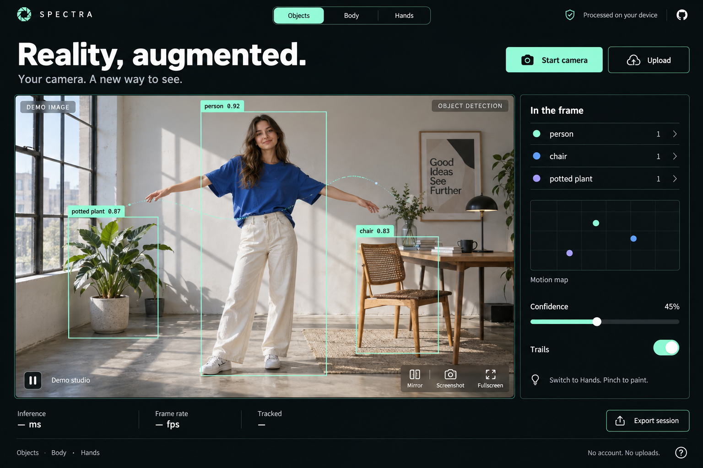

# SPECTRA

**Reality, augmented.** A camera-first computer vision studio by **Tarang Jammalamadaka**.

[Open the live studio](https://tarang-tj.github.io/spectra-vision/) · [v1.0.0](https://github.com/tarang-tj/spectra-vision/releases/tag/v1.0.0) · [Ownership and license](LICENSE)

Three real vision models turn your camera into an interactive canvas: tracked object boxes, a glowing body skeleton, and hand-controlled light painting. Everything runs in your browser.



_Interface design concept. The running app calculates its own detections, scores, tracks and performance measurements. Demo images are still photos processed by the same models used for the camera; they contain no baked-in detection overlays._

## Try it

1. Open the [live studio](https://tarang-tj.github.io/spectra-vision/). The Objects demo starts automatically; allow the model a moment to load.
2. Choose **Start camera**, or **Upload** a local image/video. Camera access requires HTTPS or localhost and browser permission.
3. Switch between **Objects**, **Body** and **Hands**. For body tracking, step back until your entire body is visible. For hand painting, pinch thumb and index together, move your hand, then release.
4. Use **Mirror**, **Trails**, **Pause**, **Screenshot**, **Fullscreen** or **Export session**. **Demo** restores the sample for the selected mode. **Stop camera** releases its media tracks.

Use a current Chrome or Edge browser for the tested path. No account or API key is needed. Model downloads total about 21 MB, plus the WebAssembly runtime; each mode loads on demand.

## What it does

| Mode    | Actual inference                                                  | Visual interaction                                                              |
| ------- | ----------------------------------------------------------------- | ------------------------------------------------------------------------------- |
| Objects | EfficientDet-Lite0, common COCO categories                        | Class/score boxes, short-lived object IDs, motion trails, selectable detections |
| Body    | BlazePose Lite, one person with 33 landmarks                      | Glowing skeleton, torso mesh, wrist and ankle motion trails                     |
| Hands   | MediaPipe Hand Landmarker, up to two hands with 21 landmarks each | Finger skeletons, fingertip rings and pinch-to-paint light trails               |

The inspector shows detections and image positions. Confidence controls the detection threshold; the motion map shows normalized image coordinates. Inference time and processed frame rate are measured, rather than illustrative counters.

**Screenshots** save the rendered canvas as PNG. **Exports** save JSON containing the latest 1,000 processed frames of the current source and mode, model outputs and settings. They include no image/video data or local filename. Exports reset when source or mode changes. Light-paint strokes are visual effects and are not included in JSON.

## Privacy

Camera frames and selected files stay in browser memory; SPECTRA has no image upload endpoint, account, analytics or face identification. The static host serves the app, fonts, runtime, models and demo assets and can receive normal HTTP request metadata. The build downloads models from Google's official storage, verifies their SHA-256 hashes, then serves them from the app's own origin.

Camera access starts only after an explicit action. Pause stops inference and freezes playback while retaining camera access; Stop camera, choosing Demo, choosing another source or leaving the app releases the stream. Screenshots and exports download only when requested.

## Run locally

Requirements: **Node.js 22.12+** and **pnpm 11.8.0**.

```sh
git clone https://github.com/tarang-tj/spectra-vision.git
cd spectra-vision
npm install --global pnpm@11.8.0
pnpm install --frozen-lockfile
pnpm run setup
pnpm run dev
```

Open the localhost URL printed by Vite. Run `pnpm run setup` explicitly: `pnpm setup` is a different, built-in pnpm command. Setup verifies the three models, copies the installed MediaPipe runtime, and assembles dependency license notices. Generated runtime/model files are deliberately excluded from Git.

```sh
pnpm run check
pnpm run test
pnpm run test:e2e
pnpm run build
pnpm run preview
```

The browser tests use an installed macOS Chrome when available; otherwise install Playwright Chromium with `pnpm exec playwright install chromium`. Set `CHROME_PATH` to use another Chrome executable. Tests use a simulated camera, real model inference and real local file uploads. They do not open your physical camera. Browser-test artifacts go to the OS temporary directory.

For the GitHub Pages subdirectory build:

```sh
PAGES_BUILD=1 pnpm run build
PAGES_BUILD=1 pnpm run preview
```

The workflow runs type checking, unit tests, a production build and real browser tests against that build before deploying `main` to Pages. Pull requests run the same checks without deployment.

## Architecture

```text
Camera / local file / labeled demo image
    → owned media source with generation token
    → ImageBitmap (one inference frame in flight)
    → dedicated vision worker / self-hosted MediaPipe WASM
    → normalized detections / landmarks
    → object association + canvas effects + inspector + JSON export
```

React and TypeScript manage controls and source ownership. A dedicated worker performs synchronous model inference away from the UI thread; the main thread renders canvas overlays. Stale results from replaced sources are discarded. Model initialization has a timeout and retry path, and mode changes terminate the previous worker. Model inference is capped at roughly 15 updates/second; canvas rendering is capped at roughly 30 draws/second. Actual throughput depends on your device.

| Path                                                  | Responsibility                                                         |
| ----------------------------------------------------- | ---------------------------------------------------------------------- |
| `src/vision/useSource.ts`                             | Permission, file decoding, camera ownership, cancellation and cleanup  |
| `src/vision/useVision.ts` / `public/vision-worker.js` | Model lifecycle, bounded frame transfer and stale-result guards        |
| `src/vision/tracker.ts`                               | Class-aware object association, missed-frame expiry and bounded trails |
| `src/vision/geometry.ts` / `render.ts`                | Letterboxing, mirroring, pinch geometry and overlays                   |
| `scripts/models.json` / `setup-assets.mjs`            | Pinned model URLs, verified hashes, runtime and notices                |
| `tests/`                                              | Association/geometry unit tests and real-model browser workflows       |

## Practical limits

- This is an interactive vision demo, not a calibrated measurement or identity system. Scores are model outputs, not guarantees.
- Lighting, occlusion, motion blur and model category coverage affect detection. Body mode follows one person. Hands can misclassify handedness; hand order can change after occlusion.
- Object IDs use geometric association, not appearance-based re-identification, and can switch when similar objects cross. Trails retain only bounded recent history.
- Pinching uses aspect-correct thumb–index distance relative to palm length, with hysteresis. It is a gesture heuristic. Reduce glare and keep fingers visible.
- The motion map and exported `x/y` positions are image coordinates; they are not physical depth. Landmark `z` values are model estimates, not calibrated distances.
- Still demos repeatedly infer the same image. A live camera or local video provides actual motion. On slower devices, CPU inference can reduce frame rate. Fullscreen and video codec support vary by browser.
- The tested browser path is Chromium on desktop and a narrow mobile viewport. Physical cameras, mobile Safari and every device/codec combination have not been verified.

## Ownership and third-party rights

**Copyright © 2026 Tarang Jammalamadaka. All rights reserved for the original SPECTRA code and original project material to the extent protected by law.** This is a public portfolio repository, not an MIT-licensed project. Publication does not grant general reuse, modification, redistribution or commercial rights to the original work. See [LICENSE](LICENSE) for the permitted viewing/demo use and rights reserved.

MediaPipe, pretrained model weights, React, icons, fonts and other dependencies retain their respective authors' rights and licenses. They are not claimed as Tarang's original work. Full details, official model references and attribution are in [THIRD_PARTY_NOTICES.md](THIRD_PARTY_NOTICES.md); every deployed build includes Apache-2.0 and installed dependency license texts under `licenses/`.

The interface concept and demo photos were AI-generated for this project. Their provenance and prompts are recorded in [docs/design/asset-provenance.md](docs/design/asset-provenance.md).
